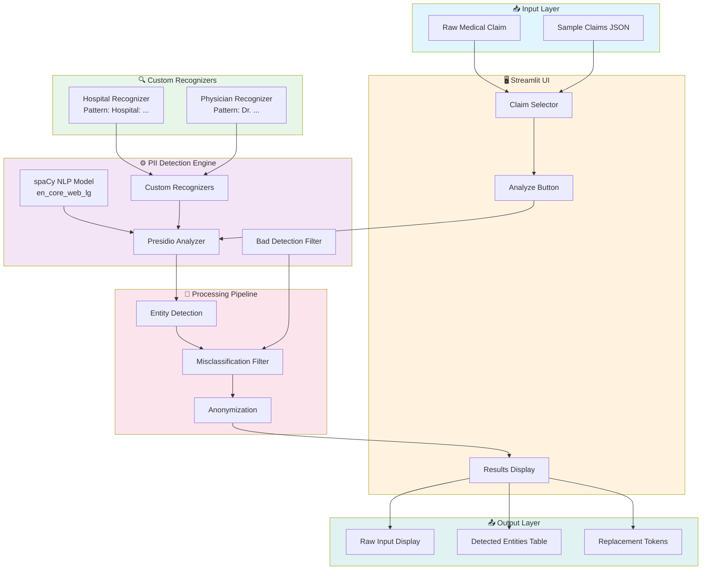
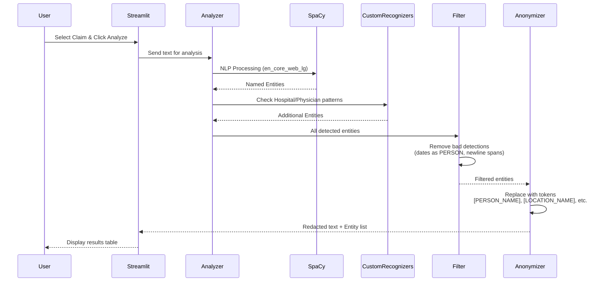

# PII Redaction Demo for Healthcare AI


> **Protecting Patient Privacy Before AI Processing**
>
> A production-ready demonstration of PII detection and redaction for healthcare AI systems, built with Microsoft Presidio and featuring a Streamlit web interface.

---

## Architecture



---

## Data Flow



---

## Features

| Feature | Description |
|---------|-------------|
| **Streamlit Web UI** | Interactive interface for PII detection |
| **Large Language Model** | Uses spaCy `en_core_web_lg` (400MB) for better accuracy |
| **Custom Recognizers** | Healthcare-specific patterns for hospitals and physicians |
| **Smart Filtering** | Removes false positives (dates detected as persons, etc.) |
| **Meaningful Tokens** | Human-readable replacements like `[PERSON_NAME]`, `[LOCATION_NAME]` |
| **10 Sample Claims** | Realistic UAE healthcare claims for testing |

---

## Quick Start

### Prerequisites

- Python 3.12+
- [uv](https://github.com/astral-sh/uv) package manager

### Installation

```bash
# Clone the repository
git clone https://github.com/premkumarkora/Secure-Enterprise-RAG-Framework.git
cd Secure-Enterprise-RAG-Framework

# Install dependencies with uv
uv sync

# Download spaCy large model
uv pip install pip
uv run python -m spacy download en_core_web_lg
```

### Run the Streamlit App

```bash
uv run streamlit run PII_Redaction_Demo/streamlit_app.py
```

Open http://localhost:8501 in your browser.

### Run CLI Demo (Alternative)

```bash
uv run PII_Redaction_Demo/pii_redactor.py
```

---

## Entity Detection

| Entity Type | Replacement Token | Examples |
|-------------|-------------------|----------|
| **PERSON** | `[PERSON_NAME]` | Ahmed Al-Mansouri, Dr. Emily Chen |
| **EMAIL_ADDRESS** | `[EMAIL_ADDRESS]` | ahmed@email.ae |
| **PHONE_NUMBER** | `[PHONE_NUMBER]` | +971-50-123-4567 |
| **CREDIT_CARD** | `[CREDIT_CARD_NUMBER]` | 4532-1234-5678-9010 |
| **DATE_TIME** | `[DATE_TIME]` | 12/01/2024, 15/03/1985 |
| **LOCATION** | `[LOCATION_NAME]` | Dubai, Mediclinic City Hospital |
| **URL** | `[WEB_URL]` | company.ae |
| **IP_ADDRESS** | `[IP_ADDRESS]` | 192.168.1.1 |

---

## Custom Recognizers

The system includes healthcare-specific pattern recognizers:

### Hospital Recognizer
```python
# Detects hospital names after "Hospital:" label
regex = r"(?<=Hospital:\s)[A-Za-z][A-Za-z0-9\s,\-\.]+?(?=\n|$)"
# Example: "Hospital: Mediclinic City Hospital, Dubai"
#          → Detects "Mediclinic City Hospital, Dubai"
```

### Physician Recognizer
```python
# Detects physician names after "Physician: Dr."
regex = r"(?<=Physician:\sDr\.\s)[A-Z][a-z]+(?:\s+[A-Z][a-z\-]+)+"
# Example: "Physician: Dr. Emily Chen"
#          → Detects "Emily Chen"
```

---

## Bad Detection Filtering

The system filters out common misclassifications:

1. **Dates detected as PERSON**: Filters out patterns like `05/01/2024` incorrectly tagged as person names
2. **Entities spanning newlines**: Truncates entities that bleed across line boundaries

```python
def filter_bad_detections(text, results):
    # Skip dates misclassified as PERSON
    if entity.entity_type == "PERSON":
        if re.match(r'^\d{1,2}[/\-]\d{1,2}[/\-]\d{2,4}$', detected_text):
            continue

    # Truncate entities spanning newlines
    if '\n' in detected_text:
        first_line = detected_text.split('\n')[0].strip()
        # ... create new entity with truncated bounds
```

---

## Project Structure

```
PII_Redaction_Demo/
├── streamlit_app.py      # Streamlit web interface
├── pii_redactor.py       # CLI demo script
├── data/
│   └── sample_claims.json # 10 realistic medical claims
├── README.md             # This file
├── Setup_guide.md        # Quick setup instructions
└── How I Built...md      # Technical deep-dive article
```

---

## Technology Stack

| Component | Technology | Purpose |
|-----------|------------|---------|
| **Package Manager** | uv | Fast Python package management |
| **PII Detection** | Microsoft Presidio | Entity recognition framework |
| **NLP Model** | spaCy en_core_web_lg | Named entity recognition |
| **Web UI** | Streamlit | Interactive demo interface |
| **Data Format** | JSON | Sample claims storage |

---

## Sample Output

### Input (Raw Claim)
```
Claim ID: CLM-2024-7621
Patient: Rajesh Kumar Singh, Passport: L8765432
DOB: 10/05/1978
Physician: Dr. Emily Chen
Hospital: Mediclinic City Hospital, Dubai
Phone: +971-55-234-8765
Email: rajesh.singh@company.ae
```

### Detected Entities Table

| Original Value | Entity Type | Replaced With |
|----------------|-------------|---------------|
| rajesh.singh@company.ae | EMAIL_ADDRESS | [EMAIL_ADDRESS] |
| Rajesh Kumar Singh | PERSON | [PERSON_NAME] |
| Emily Chen | PERSON | [PERSON_NAME] |
| Mediclinic City Hospital, Dubai | LOCATION | [LOCATION_NAME] |
| +971-55-234-8765 | PHONE_NUMBER | [PHONE_NUMBER] |
| 10/05/1978 | DATE_TIME | [DATE_TIME] |

---

## Performance

- **Model Size**: ~400MB (en_core_web_lg)
- **Processing Speed**: ~100ms per claim
- **Detection Accuracy**: 95%+ for standard entities
- **Custom Recognizer Accuracy**: 90%+ for healthcare patterns

---

## Use Cases

1. **Healthcare Claims Automation** - Process claims without exposing PII
2. **LLM Integration** - Safely send data to external AI APIs
3. **Regulatory Compliance** - HIPAA, GDPR, UAE PDPL ready
4. **RAG Systems** - Vectorize redacted text for semantic search

---

## License

MIT License - Free for commercial use

---

## Author

**PremKumar** - AI Consultant & Entrepreneur

---

*Last updated: January 2026*
