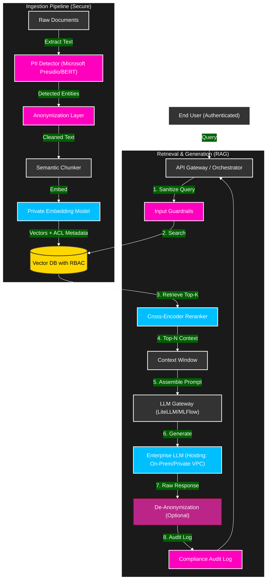

## The CISO’s Nightmare & The Zero-Trust RAG"

1. (The Business Problem)

In my previous role, we faced a classic 'Enterprise AI Paradox.' We had terabytes of rich, unstructured data—medical claims, insurance policies, and customer histories. The business wanted to unleash an LLM on this data to automate approvals and reduce that 5-day cycle time to minutes.
But here was the roadblock: We couldn't just dump this data into a vector database or an LLM. It was full of PII (names, Emirates IDs equivalent, medical conditions). If a junior analyst asked, 'Show me high-value claims,' the AI might hallucinate or reveal a CEO’s private medical data. Our CISO was never going to sign off on a 'Black Box' that leaks privacy."

2. Architecture

I realized that standard RAG (Retrieval-Augmented Generation) wasn't enough. We needed a 'Zero-Trust' RAG architecture. I had to design a system where the AI is smart enough to answer questions but blind to the specific data it shouldn't see.

3. The Technical Implementation

The Airlock (PII Redaction): "First, I built an ingestion 'airlock.' Before any document touched our Vector Database, it went through a PII sanitization layer (using tools like Microsoft Presidio or custom BERT models). We replaced 'John Doe' with <PERSON_1> and 'Diabetes' with <CONDITION_A>. The AI learns the patterns of the claim without ever seeing the identity."

The bouncer (Row-Level Security): "Next, I solved the access problem. I didn't just store vectors; I stored Access Control Lists (ACLs) as metadata alongside the vectors. If a user queries the system, the database filters first based on their role. If you are a Junior Analyst, the system literally cannot 'see' the VP's data chunks to retrieve them."

The Orchestrator (Multi-Agent Setup): "Finally, I used a Multi-Agent setup. One agent retrieves the data, a second agent 'audits' the answer for leakage, and a third agent formats it. This 'Council of Agents' ensures no single prompt injection can trick the system."

4. The Result

The result was a robust, privacy-first engine. We moved from a complete standstill on AI adoption to automating 80% of claims. We achieved the speed of GenAI with the security rigor of a bank vault. We proved that you don't have to choose between innovation and compliance—you just need the right architecture.

---

# Secure Enterprise RAG Framework (Privacy-First Architecture)

## Overview
A reference architecture for a **Zero-Trust Retrieval-Augmented Generation (RAG)** system designed for highly regulated industries (Healthcare, Banking, Government). 

Unlike standard RAG implementations, this framework prioritizes **Data Sovereignty** and **PII Protection** by implementing an "airlock" ingestion strategy: sensitive entities are detected and redacted *before* vectorization, ensuring no PII ever enters the semantic search index or the LLM context window without strict authorization.

## 🏗️ Architecture

This system follows a "Defense in Depth" approach to AI governance.

```mermaid
graph LR
    %% --- GLOBAL STYLES ---
    %% Use GitHub's Dark Mode background color for seamless integration
    classDef default fill:#0d1117,stroke:#30363d,stroke-width:1.5px,color:#c9d1d9;
    
    %% Custom "Neon" Colors for High Contrast
    classDef security fill:#2e001f,stroke:#ff00bf,stroke-width:2px,color:#fff;
    classDef ai fill:#001a2e,stroke:#00bfff,stroke-width:2px,color:#fff;
    classDef db fill:#2e2800,stroke:#ffd700,stroke-width:2px,color:#fff;
    classDef user fill:#1f6feb,stroke:#fff,stroke-width:2px,color:#fff;

    %% --- MAIN FLOW ---
    
    %% User is the trigger
    User["👤 End User"]:::user -->|Query| API["⚡ API Gateway"]:::default

    %% 1. INGESTION PIPELINE (Left Side)
    subgraph Ingestion ["🔒 SECURE INGESTION ZONE"]
        direction TB
        Docs["📄 Raw Docs"]:::default --> PII_Scan["👁️ PII Detector"]:::security
        PII_Scan -->|Redact| PII_Mask["🛡️ Anonymizer"]:::security
        PII_Mask --> Chunker["✂️ Chunker"]:::default
        Chunker --> Embed["🧠 Private Embeddings"]:::ai
    end

    %% Connect Ingestion to DB
    Embed -->|Safe Vectors| VectorDB[("🗄️ Vector DB (RBAC)")]:::db

    %% 2. RAG PIPELINE (Right Side)
    subgraph Retrieval ["🤖 RAG INFERENCE ZONE"]
        direction TB
        API -->|1. Sanitize| Guard["🛑 Input Guardrails"]:::security
        Guard -->|2. Search| VectorDB
        
        VectorDB -->|3. Hits| ReRanker["⚖️ Cross-Encoder"]:::ai
        ReRanker -->|4. Context| Context["📝 Context Window"]:::default
        
        Context -->|5. Prompt| LLM_Gate["BRIDGE (LiteLLM)"]:::default
        LLM_Gate -->|6. Infer| LLM["🧠 Enterprise LLM"]:::ai
        
        LLM -->|7. Reply| Deanonymize["🔓 De-Anonymizer"]:::security
        Deanonymize -->|8. Log| Audit["📜 Audit Log"]:::security
    end

    %% Close the loop
    Audit -.->|Response| API

    %% --- SUBGRAPH STYLING (The Dark Mode Fix) ---
    %% This sets the container boxes to be dark/transparent so they don't look like white blocks
    style Ingestion fill:#161b22,stroke:#30363d,stroke-width:2px,stroke-dasharray: 5 5,color:#fff
    style Retrieval fill:#161b22,stroke:#30363d,stroke-width:2px,stroke-dasharray: 5 5,color:#fff
```

