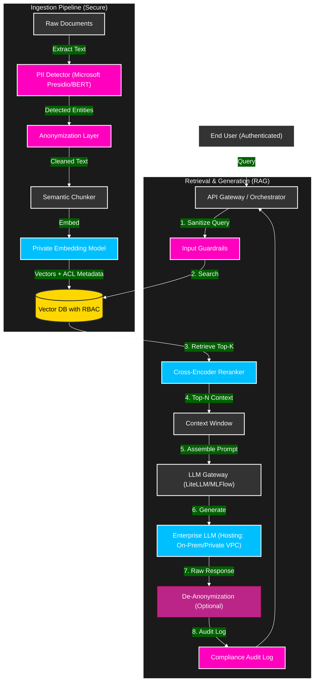

# Secure Enterprise RAG Framework (Privacy-First Architecture)

## Overview
A reference architecture for a **Zero-Trust Retrieval-Augmented Generation (RAG)** system designed for highly regulated industries (Healthcare, Banking, Government). 

Unlike standard RAG implementations, this framework prioritizes **Data Sovereignty** and **PII Protection** by implementing an "airlock" ingestion strategy: sensitive entities are detected and redacted *before* vectorization, ensuring no PII ever enters the semantic search index or the LLM context window without strict authorization.

## 🏗️ Architecture

This system follows a "Defense in Depth" approach to AI governance.

